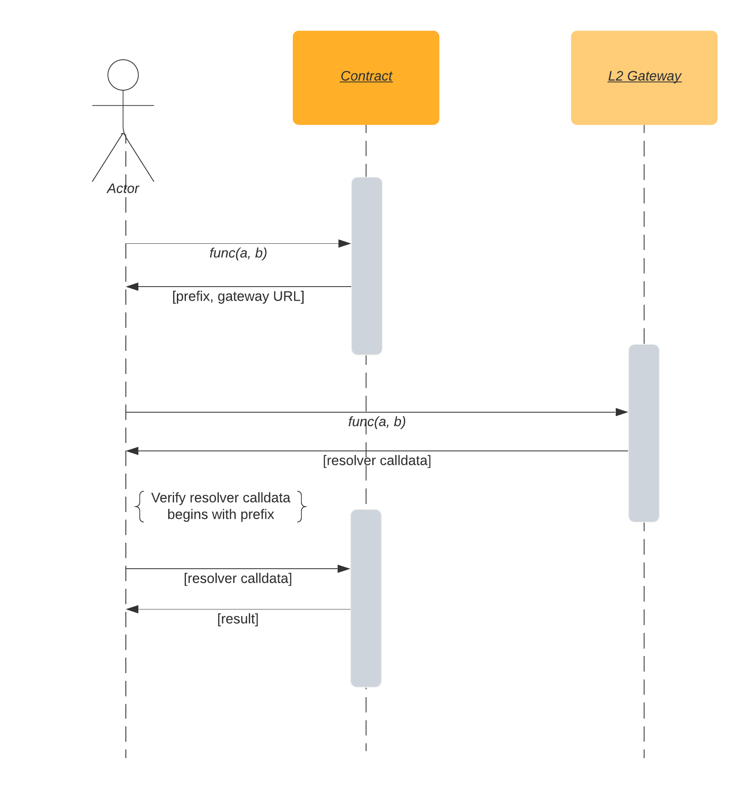

# L2 Gateway Demo
A demonstration and MVP of an Ethereum <-> Optimism bridge for resolving ENS names.

This is an implementation of the ideas outlined in [this Medium post](https://medium.com/the-ethereum-name-service/a-general-purpose-bridge-for-ethereum-layer-2s-e28810ec1d88).

## Usage

In a terminal window, download, build, and run Optimism's integration repository:

```
$ git clone git@github.com:ethereum-optimism/optimism-integration.git --recurse-submodules
$ cd optimism-integration

# The `docker` submodule is a one stop shop for building containers
$ ./docker/build.sh

# Run published images of full system
$ make up
```

In a second terminal window, deploy our code to the L1 and L2 chains exposed by optimism-integration:

```
$ git clone git@github.com:ensdomains/l2gateway-demo.git
$ cd l2gateway-demo/contracts
$ git checkout optimism
$ npm install
$ npx hardhat --network integration run scripts/deploy.js
```

Make note of the ENS registry address logged to the console.

Now run the gateway service:

```
$ cd ../gateway
$ npm install
$ npm run serve
```

In a third console window, serve up the demo app:

```
$ cd l2gateway-demo/caller
$ python -m SimpleHTTPServer
```

Finally, go to [http://localhost:8000/](http://localhost:8000/) in your browser to try the demo out.

## Components
### [Caller](caller)
A very simple webapp that demonstrates the flow of resolving an ENS name via an L2 gateway.

### [Contracts](contracts)
`OptimismResolverStub` is a L1 (Ethereum) ENS resolver contract that implements the proposed protocol, with
functions to return the gateway address and required prefix for a query, and to verify the response from the gateway.

`OptimismResolver` is an L2 (Optimism) ENS resolver contract that stores and returns the data necessary to resolve an ENS name.

### [Gateway](gateway)
A node-based gateway server that answers queries for l2 gateway function calls relating to Optimism-based L2 resolvers.

## Operation


Calling an l2 gateway function is a three-step process:

 1. Call the contract's "stub" function with the desired parameters - eg `addr(address)`. The function returns `prefix` and `url`.
 2. Make a POST request to the gateway server at `url` with the same calldata as in step 1. The server returns `callbackData`.
 3. Check that `callbackData` starts with `prefix`; if it does not, throw an error. This check prevents the gateway server from serving you the result of a different query than the one you requested.
 4. Call the contract with `callbackData`; the return value is the result of the call.

Sending a transaction follows the same process, but results in a transaction instead of a call in step 3.
